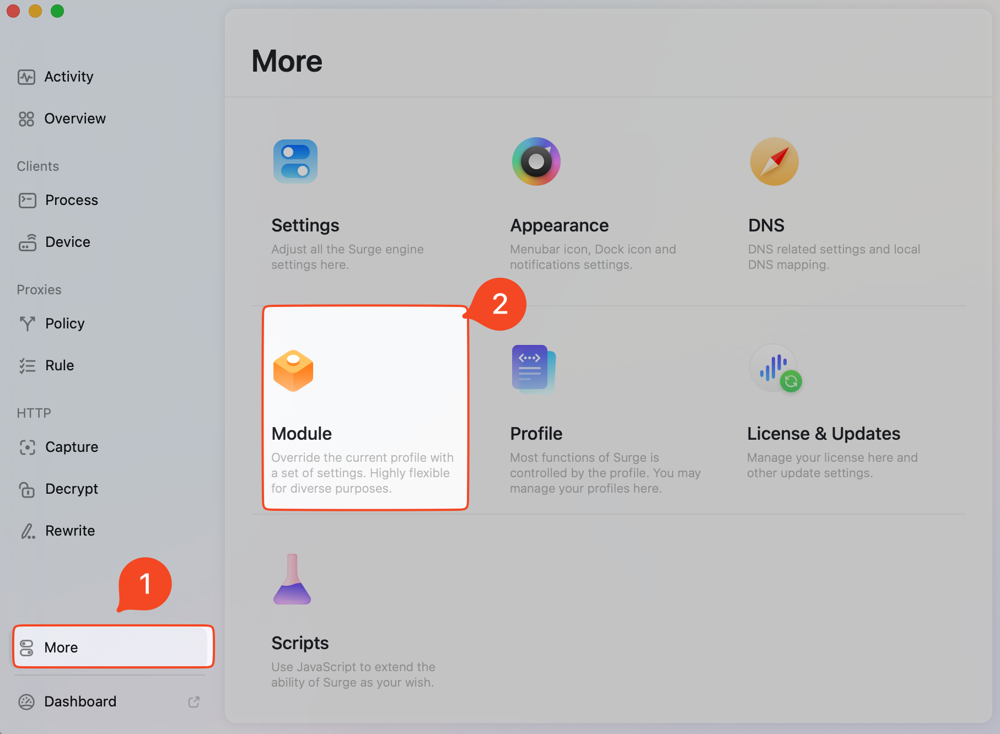

# Surge Modules

Collection of Surge modules for Mac - VPN integrations and custom configurations.

## SealSuite VPN Integration Module

This module configures Surge to work properly with SealSuite VPN using multiple exclusion methods: domain-based proxy skipping, IP-based TUN interface exclusions, and process-based routing rules.

📊 **[View Integration Flow Diagram](docs/sealsuite-surge-integration-flow.md)** - Visual guide showing how SealSuite VPN and Surge work together

### Features

- Skip proxy for Claude AI and Anthropic domains
- Exclude Claude AI and Anthropic IP addresses from TUN interface routing
- Direct routing for corplink-service process traffic
- Multi-layer protection for comprehensive VPN integration
- Ensures proper functionality when using SealSuite VPN alongside Surge
- Easy URL-based installation

### Installation

#### Method 1: Install from URL (Recommended)

1. Open **Surge for Mac**
2. Navigate to the **Module** section (More → Module)
   
   

3. Click **Install from URL...**
   
   

4. Paste the following URL:
   ```
   https://raw.githubusercontent.com/Liu-huaicheng/surge-modules/main/sealsuite-vpn.sgmodule
   ```
   
   

5. Click **Done** to install the module

6. Enable the module by checking the **Enabled** checkbox
   
   

7. Click **Apply** to save changes

#### Method 2: Manual Installation

1. Download the `sealsuite-vpn.sgmodule` file
2. Open **Surge for Mac**
3. Go to the **Modules** tab
4. Click **Install Module from File**
5. Select the downloaded file

### Updating the Module

To update the module to get the latest changes:

1. Open **Surge for Mac**
2. Navigate to the **Module** section (More → Module)
3. Find the **SealSuite VPN Integration** module
4. Right-click on the module to show the context menu
5. Select **Update...** from the menu
   
   

6. The module will automatically fetch and apply the latest version
7. Click **Apply** to save changes

> **💡 Tip**: You can also use **Copy URL** from the context menu to share the module URL with others, or **Delete...** to remove the module if needed.

### What This Module Does

The module adds multi-layer exclusions to your Surge setup:

```ini
[General]
# Skip proxy for Claude AI and Anthropic domains
skip-proxy = %APPEND% *.claude.ai, *.anthropic.com, claude.ai, anthropic.com

# Exclude Claude AI and Anthropic IP addresses from TUN interface
tun-excluded-routes = %APPEND% 160.79.104.10/32

[Rule]
# Direct connection for corplink-service process
PROCESS-NAME,/usr/local/corplink/corplink-service,DIRECT
```

This configuration provides comprehensive protection:

- **Domain-based exclusion** (`skip-proxy`): Handles domain resolution and works with Surge's proxy server
- **IP-based exclusion** (`tun-excluded-routes`): Excludes specific IP addresses from TUN interface routing, ensuring traffic bypasses the VPN tunnel entirely
- **Process-based routing** (`PROCESS-NAME`): Routes traffic from specific processes (corplink-service) directly without proxy

All configurations work together to ensure that traffic to Claude AI and Anthropic services, plus corplink-service process traffic, goes directly through your SealSuite VPN connection without interference from Surge's routing.

> **📝 Important Note**: Some network requests may bypass Surge entirely due to SealSuite VPN's built-in DNS server and intelligent routing. SealSuite DNS classifies domains and can redirect corporate/internal traffic through VPN tunnels before Surge processes them. This module ensures that excluded services (Claude AI, Anthropic, corplink-service) work optimally in this mixed routing environment.

### Compatibility

- **Platform**: macOS only
- **Surge Version**: Compatible with Surge for Mac
- **SealSuite VPN**: Works with all SealSuite VPN configurations

### Support

If you encounter any issues:

1. Make sure both Surge and SealSuite VPN are properly configured
2. Check that the module is enabled in Surge's Modules tab
3. Restart Surge after installing the module

### License

This module is provided as-is for educational and personal use.