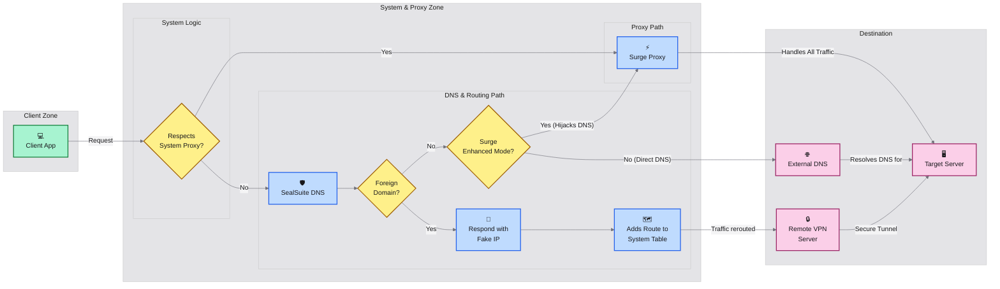

# SealSuite VPN & Surge Integration Flow

Visual guide showing how network requests are handled when using SealSuite VPN alongside Surge for Mac.

## Network Request Flow Diagram

## Flow Components Explained

### Client Zone
- **💻 Client App**: Any application on the user's device making network requests

### System & Proxy Zone
- **🛡️ SealSuite DNS**: Built-in DNS server that intelligently classifies domains
- **⚡️ Surge Proxy**: Surge for Mac handling proxy requests when system proxy is enabled
- **🔀 Fake IP Response**: SealSuite returns fake IPs for foreign domains to trigger routing
- **🗺️ System Route Table**: OS-level routing rules added by SealSuite

### Destination
- **🖥️ Target Server**: Final destination server (corporate or external)
- **🌐 External DNS**: Public DNS servers for domain resolution
- **🔒 Remote VPN Server**: SealSuite VPN gateway for secure corporate access

## Request Flow Process

1. **Initial Request**: Client app initiates a network request
2. **System Proxy Check**: System determines if the request should go through configured proxy
3. **DNS Classification**: SealSuite DNS analyzes the domain:
   - **Corporate domains**: Classified as "non-foreign" → routed through VPN tunnel
   - **External domains**: Classified as "foreign" → handled based on configuration
4. **Routing Decision**: Based on domain classification and Surge configuration:
   - **VPN Path**: Corporate resources → secure tunnel to VPN server
   - **Proxy Path**: External resources → through Surge proxy (if enhanced mode enabled)
   - **Direct Path**: External resources → direct DNS resolution (if enhanced mode disabled)

## Integration Benefits

- **🎯 Intelligent Routing**: Automatic classification and routing based on domain type
- **🔒 Security**: Corporate resources always go through secure VPN tunnel
- **⚡ Performance**: External traffic can be optimized through Surge
- **🔄 Seamless Integration**: No manual configuration needed for most scenarios
- **🛡️ DNS Protection**: Built-in DNS prevents leaks and ensures proper routing

## Module Configuration Impact

The SealSuite VPN Integration module ensures:
- Claude AI and Anthropic domains bypass Surge processing
- Corporate traffic (corplink-service) routes directly through VPN
- IP-based exclusions prevent TUN interface conflicts
- Multi-layer protection maintains optimal performance