# How SealSuite Works

This document explains the operational mechanism of SealSuite VPN and how it integrates with Surge for Mac.

## SealSuite Workflow Diagram

```mermaid
%%{init: {'theme': 'base', 'themeVariables': { 'primaryColor': '#F8FAFC', 'primaryTextColor': '#1E293B', 'primaryBorderColor': '#CBD5E1', 'lineColor': '#475569', 'secondaryColor': '#F1F5F9', 'tertiaryColor': '#E2E8F0', 'background': '#FFFFFF', 'mainBkg': '#F8FAFC', 'secondBkg': '#F1F5F9'}}}%%
flowchart TD
    %% Setup Phase
    Start([🚀 SealSuite Starts]) --> Setup[🔧 Configure Local DNS Server<br/>as Highest Priority]
    Setup --> Ready[✅ System Ready<br/>All DNS Queries Intercepted]

    %% Application Request
    Ready --> AppReq[💻 Application Makes<br/>Network Request]

    %% Proxy Detection
    AppReq --> ProxyCheck{🔍 Application Respects<br/>System Proxy?}

    %% Surge Path
    ProxyCheck -->|Yes| SurgeProxy[⚡ Surge Proxy<br/>Handles Request]
    SurgeProxy --> SurgeRules[📋 Apply Surge Rules<br/>& Optimizations]
    SurgeRules --> SurgeTarget[🎯 Route to Target<br/>via Surge]

    %% SealSuite DNS Path
    ProxyCheck -->|No| DNSIntercept[🛡️ SealSuite DNS<br/>Intercepts Query]

    %% Domain Classification
    DNSIntercept --> DomainCheck{🌍 Foreign/International<br/>Domain?}

    %% Foreign Domain Path
    DomainCheck -->|Yes| FakeIP[🔀 Return Fake IP<br/>Address 30.100.x.x]
    FakeIP --> RouteAdd[🗺️ Add Route to<br/>System Table]
    RouteAdd --> VPNTunnel[🔒 Route via VPN<br/>Tunnel]
    VPNTunnel --> VPNServer[🌐 VPN Server Resolves<br/>Real DNS & Forwards]
    VPNServer --> ForeignTarget[🎯 International<br/>Target Server]

    %% Domestic Domain Path
    DomainCheck -->|No| RealIP[✅ Return Real IP<br/>Address]
    RealIP --> EnhanceCheck{⚙️ Surge Enhanced<br/>Mode Enabled?}

    %% Enhanced Mode Paths
    EnhanceCheck -->|Yes| SurgeEnhanced[⚡ Route via Surge<br/>for Optimization]
    SurgeEnhanced --> DomesticTarget[🏠 Domestic<br/>Target Server]

    EnhanceCheck -->|No| DirectRoute[🔄 Direct Route<br/>to Target]
    DirectRoute --> DomesticTarget

    %% Styling
    classDef setupPhase fill:#DBEAFE,stroke:#3B82F6,stroke-width:2px,color:#1E40AF
    classDef dnsProcess fill:#D1FAE5,stroke:#10B981,stroke-width:2px,color:#065F46
    classDef decision fill:#FEF3C7,stroke:#F59E0B,stroke-width:2px,color:#92400E
    classDef surgeProcess fill:#E0E7FF,stroke:#8B5CF6,stroke-width:2px,color:#5B21B6
    classDef vpnProcess fill:#FECACA,stroke:#EF4444,stroke-width:2px,color:#B91C1C
    classDef target fill:#F3E8FF,stroke:#A855F7,stroke-width:2px,color:#7C2D12

    class Start,Setup,Ready setupPhase
    class DNSIntercept,FakeIP,RealIP,RouteAdd dnsProcess
    class ProxyCheck,DomainCheck,EnhanceCheck decision
    class SurgeProxy,SurgeRules,SurgeEnhanced surgeProcess
    class VPNTunnel,VPNServer vpnProcess
    class SurgeTarget,ForeignTarget,DomesticTarget,DirectRoute target
```

## Flowchart Components Explained

### Setup Phase (Blue)
- **🚀 SealSuite Starts**: Initial application launch
- **🔧 Configure Local DNS Server**: Sets up SealSuite as the highest priority DNS server in system settings
- **✅ System Ready**: All DNS queries are now intercepted by SealSuite

### Decision Points (Yellow)
- **🔍 Application Respects System Proxy?**: Determines if the application honors system proxy settings
- **🌍 Foreign/International Domain?**: Classifies domains as foreign (international) or domestic
- **⚙️ Surge Enhanced Mode Enabled?**: Checks if Surge's enhanced mode is active for domestic traffic

### DNS Processing (Green)
- **🛡️ SealSuite DNS Intercepts Query**: Local DNS server receives and processes the DNS request
- **🔀 Return Fake IP Address**: Provides a fake IP (30.100.x.x range) for foreign domains to trigger VPN routing
- **✅ Return Real IP Address**: Provides the actual IP for domestic domains
- **🗺️ Add Route to System Table**: Creates system-level routing rules for fake IPs (30.100.x.x range)

### Surge Processing (Purple)
- **⚡ Surge Proxy Handles Request**: Processes requests from proxy-aware applications
- **📋 Apply Surge Rules & Optimizations**: Applies filtering, ad blocking, and routing rules
- **⚡ Route via Surge for Optimization**: Handles domestic traffic when enhanced mode is enabled

### VPN Processing (Red)
- **🔒 Route via VPN Tunnel**: Directs traffic through the secure VPN connection
- **🌐 VPN Server Resolves Real DNS**: VPN server performs actual DNS resolution for foreign domains

### Target Destinations (Purple)
- **🎯 Route to Target via Surge**: Final destination reached through Surge proxy
- **🎯 International Target Server**: Foreign servers accessed via VPN tunnel
- **🏠 Domestic Target Server**: Local servers accessed directly or via Surge
- **🔄 Direct Route to Target**: Direct access without proxy processing

## SealSuite Core Workflow

### 1. DNS Server Setup

SealSuite starts a local DNS server on the user's machine and configures it as the highest priority DNS server in the system. This ensures that all DNS queries from applications are intercepted and handled by SealSuite's intelligent DNS resolver.

### 2. DNS Query Interception

When any application on the system makes a network request, the DNS query is automatically routed to SealSuite's local DNS server instead of the default system DNS servers. This gives SealSuite complete control over domain name resolution.

### 3. Intelligent DNS Response Logic

SealSuite analyzes each incoming DNS query and applies different response strategies based on the domain classification:

#### For Foreign/International URLs:
- **Returns a fake IP address** (from the 30.100.x.x range) instead of the real IP
- The fake IP is specifically chosen to trigger SealSuite's routing mechanisms
- This ensures that the actual DNS resolution will happen on the VPN server

#### For Domestic URLs:
- **Returns the real IP address** obtained through standard DNS resolution
- Allows direct access to domestic resources without VPN overhead
- Maintains optimal performance for local services

### 4. Why Fake IPs for Foreign Requests?

SealSuite uses fake IP addresses (30.100.x.x range) for foreign domains for several critical reasons:

#### Performance Optimization
- **VPN Server Resolution**: DNS resolution occurs on the VPN server, which often has better connectivity to international services
- **Reduced Latency**: Eliminates multiple DNS lookup hops that would occur with local resolution

#### Network Policy Compliance
- **Domestic Network Restrictions**: Local DNS resolution may fail due to domestic network policies or DNS filtering
- **Reliable Access**: VPN server-based resolution bypasses local network limitations

#### CDN Geo-location Benefits
- **Optimal Server Selection**: CDN services can select the best server based on the VPN server's location
- **Better Performance**: Results in faster content delivery from geographically optimized servers

#### Overall Request Performance
- **Single Point Resolution**: Consolidates DNS resolution to the VPN server where the request will be processed
- **Eliminates DNS Leaks**: Prevents DNS queries from revealing user's actual location or browsing patterns

## Integration with Surge

SealSuite works seamlessly alongside Surge for Mac through intelligent traffic distribution:

### Applications That Respect Proxy Settings
- **Handled by Surge**: Applications that honor system proxy settings are automatically routed through Surge
- **Surge Processing**: These requests benefit from Surge's advanced routing rules, ad blocking, and traffic optimization

### Applications That Ignore Proxy Settings
- **Handled by SealSuite**: Applications that bypass system proxy settings have their traffic intercepted by SealSuite
- **VPN Routing**: These requests are routed through the VPN tunnel to ensure they don't leak outside the secure connection

### Default Traffic Handling
- **Foreign Requests**: By default, all international traffic is handled by SealSuite's VPN tunnel
- **Secure Routing**: Ensures that sensitive international communications are always protected

### Enhanced Mode Integration
When Surge's "enhance mode" is enabled:
- **Domestic Traffic via Surge**: Even domestic requests can be processed through Surge for additional filtering and optimization
- **Dual Protection**: Combines SealSuite's DNS intelligence with Surge's advanced proxy capabilities
- **Comprehensive Coverage**: Provides complete traffic management for both domestic and international requests

## Technical Implementation

### DNS Server Priority
- SealSuite configures itself as the primary DNS server in the system's network settings
- All DNS queries are intercepted before reaching external DNS servers
- Maintains a backup mechanism to ensure DNS resolution continues if SealSuite is unavailable

### Route Table Management
- Fake IP addresses (30.100.x.x range) trigger automatic route table entries
- System-level routing ensures traffic flows through the VPN tunnel
- Dynamic route management adapts to changing network conditions

### Proxy Detection and Coordination
- SealSuite detects when Surge is active and coordinates traffic handling
- Prevents conflicts between VPN routing and proxy processing
- Ensures optimal performance regardless of application proxy compliance